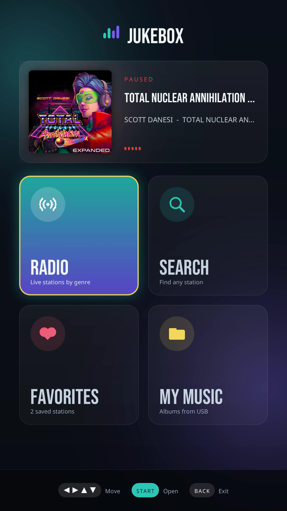
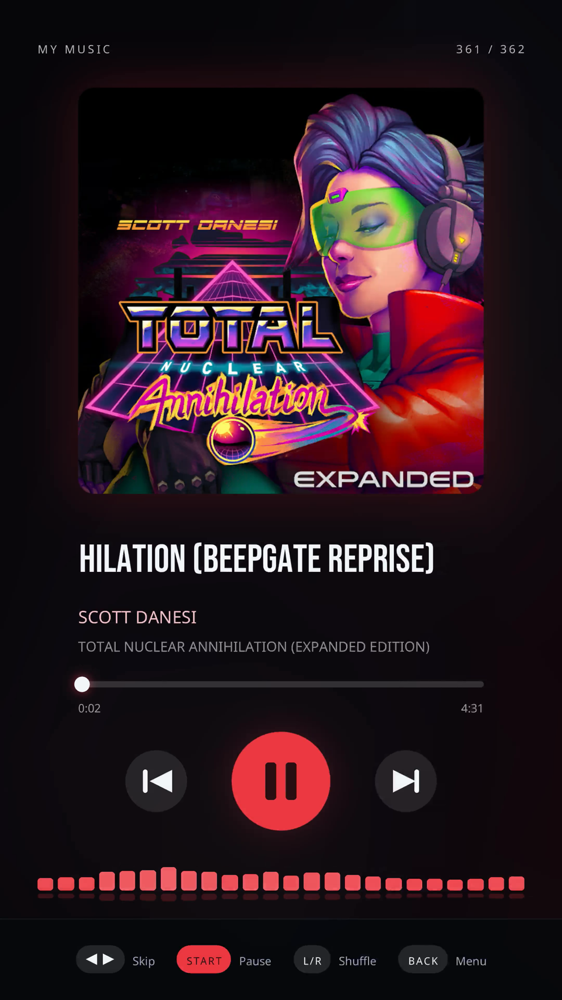
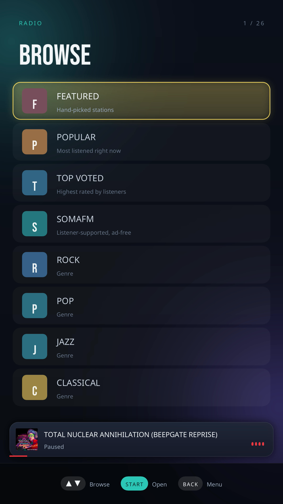

# 🎛️ Jukebox

<p align="center">
  
  
  
</p>


A music and internet-radio player for AtGames devices. Browse thousands of online
radio stations, search by name, save your favorites, or play audio files from a
USB drive — with an album-tinted **Now Playing** screen, a spinning record for
radio, and a live spectrum analyzer that dances to the music.

Plays MP3, AAC, FLAC, OGG, Opus, WAV, and WMA.

---

## ✨ New in 2.1

- **The right thing on every screen.** On the HDP, the menu used to appear on
  the backglass with the backglass artwork on the playfield. Which physical
  screen is which varies by cabinet, and Jukebox now reads the model and places
  all three correctly on both the 4KP and the HDP.
- **Favorites without the arcade control panel.** Saving a station needed `Y`,
  which plain cabinets don't have. **A flipper** now saves (or removes) the
  highlighted station, and favorites the station on Now Playing. `Y` still works
  if you have the panel.

Full history in [CHANGELOG.md](CHANGELOG.md).

## New in 2.0

- **A redesigned look.** Smooth rounded shapes, soft glows, one consistent type
  scale, and a button legend along the bottom of every screen showing exactly
  which buttons do what.
- **Now Playing takes on the album's colors** — the cover fills the background
  as a soft blur, the art sits large in front, and a **progress bar** shows elapsed
  and total time.
- **Radio gets a spinning record** with the spectrum radiating around it and a
  pulsing **LIVE** badge.
- **A new main menu** — a Now Playing card with the current artwork, and big
  tiles for Radio, Search, Favorites, and My Music.
- **A mini player** on every list, so you can see what's playing while you browse.
- **FLAC album art now shows**, even for large embedded covers.
- **Every artist is listed** — artists on compilations and soundtracks used to
  go missing — and picking an artist now opens **that artist's songs**.
- **Lists wrap around** — go past the bottom and you're back at the top.
- **Long titles scroll on the backglass** instead of shrinking.

---

## How it works

Open Jukebox and you land on the main menu:

| | |
| --- | --- |
| **🎵 Now Playing** (top card) | What's playing, with its album art. Open it for the full Now Playing screen. |
| **📻 Radio** | Browse curated categories — a **Featured** shortlist (WMMR 93.3 Philadelphia, Q104.3 Halifax), Popular, Top Voted, SomaFM, and genres like Rock, Jazz, Lo-fi, Ambient — streamed live from the online directory. |
| **🔎 Search** | Type a station name on the on-screen keyboard to find it. |
| **❤️ Favorites** | Your saved stations, kept between sessions. |
| **📁 My Music** | Your own music from a USB drive, browsable by album and artist. |

Pick a station or track and it starts playing. Playback keeps going in the
background while you browse other screens — the **mini player** at the bottom of
each list shows what's on — so hunting for the next song never cuts the music.
In any list, a name too long to fit **scrolls** while it's highlighted, and lists
**wrap** from the last row back to the first (and the other way).

On **Now Playing**, a local track shows its **album cover** over a blurred wash of
itself, with the title, artist, album, and a **progress bar**. The play button and
highlights take on the album's colors. No art? A record spins in its place. For
radio, the record spins with the spectrum radiating around it, and the station's
codec, bitrate, and favorite status sit beneath its name. `←/→` skip to the
previous or next track (or station) from wherever you started listening. When a
local track finishes, the **next one plays automatically** — and with **shuffle**
on, the queue plays in a random order.

---

## 🎵 Playing your own music

Jukebox looks for a folder named **`music`** at the **root of a USB drive**, then
scans it (and every sub-folder) and builds a browsable library — grouped by
**Album** and **Artist**, like iTunes.

1. On a computer, open your USB drive.
2. Create a folder named `music` (all lowercase) in the drive's root.
3. Copy your music into it. Sub-folders **are** scanned, so an
   `Artist/Album/track` layout works great.
4. Eject the drive, plug it into the device, and open **My Music**.

```
USB DRIVE (root)
└── music/
    ├── Daft Punk/
    │   └── Discovery/
    │       ├── cover.jpg
    │       ├── 01 One More Time.mp3
    │       └── 02 Aerodynamic.mp3
    └── Bonobo/
        └── Migration/
            └── 01 Migration.flac
```

**Browsing:** My Music opens to **Albums**, **Artists**, **All Tracks**, or a
**Shuffle** toggle.

- **Albums** lists every album with its artist and track count. Open one and play
  a track — `←/→` on Now Playing then steps through that album, and when it ends
  the next track starts on its own.
- **Artists** lists everyone in your library, including artists who only appear on
  a compilation or soundtrack. Pick one to see **all of their songs** across every
  album (each shown with the album it's from), and play straight from there.

Albums are grouped by name *and* folder, so two different albums that share a
name (say, two *Greatest Hits*) stay separate. An album split into `CD1` / `CD2`
(or `Disc 1` / `Disc 2`) sub-folders stays one album, and an album with several
artists shows as **Various Artists**.

**Album art** comes from either:

- an image in the album's folder — `cover`, `folder`, or `front` (`.jpg`, `.jpeg`,
  or `.png`, any capitalization), Windows Media Player's `AlbumArt…Large.jpg`, or
  failing those, any other image in the folder; or
- a picture embedded in the file — MP3 (`APIC`) or FLAC (`PICTURE`), at any size.
  When a file has several pictures, the front cover wins.

No art? A spinning record shows instead. Pictures embedded in M4A/AAC files
aren't read yet — put a `cover.jpg` in the folder for those.

**Shuffle:** turn it on from the **Shuffle** row (it shows ON/OFF) or with a
**flipper** on Now Playing while local music is playing. It's a mode — once on, whatever you play
(an album, an artist, or All Tracks) runs in random order until you turn it off,
and Now Playing shows a **SHUFFLE** tag.

**Where the album/artist names come from:** Jukebox reads the embedded tags —
**ID3v2** in MP3s and **Vorbis comments** in FLAC (title, artist, album, track
number). For other files, or files without tags, it falls back to the folder
layout: the file's parent folder becomes the album and the one above it the
artist. Anything it can't place lands under **Unknown Album / Unknown Artist**.

**Supported formats:** `mp3` · `m4a` · `aac` · `flac` · `ogg` · `opus` · `wav` · `wma`
(tags are read from MP3 and FLAC; the rest still play and group by folder.)

Seeing *"No music found"*? Make sure the folder is named exactly `music`, sits at
the drive's root, and holds files of the types above. A large library shows
**"Scanning library…"** briefly on first open while tags are read.

---

## On the backglass and DMD

Jukebox lights them up too:

- The **backglass** shows the current album cover big — the crisp cover over a
  soft, blurred wash of itself, with the track title and artist beneath. A title
  or artist too long to fit **scrolls** across instead of shrinking. On radio it
  shows the station name.
- The **DMD** strip becomes a lit **Jukebox marquee** — the logo on a neon
  gradient, with the track title (or station name) captioned below it.

Which physical screen is which differs between cabinet models, so Jukebox reads
the model to place the playfield, backglass and DMD correctly. The panels redraw
only when the track changes (plus the scrolling line, when there is one), so
they never affect playback or the spectrum analyzer. Cabinets without extra
panels simply ignore them.

**If a screen still shows the wrong thing**, create a file named `jukebox.cfg`
at the root of the USB stick with `diag = 1` in it. Jukebox then labels each
panel on screen and writes `jukebox-panels.log` beside the file, which is enough
to work out what your cabinet is doing. The same file can force the assignment:
`playfield`, `backglass` and `dmd` each take a connector number from the log.

---

## Controls

The bottom of every screen shows the buttons that work there. **Flipper** means
either shoulder button, so nothing needs the arcade control panel — `Y` and `X`
still work for anyone who has one.

| Screen | Buttons |
| --- | --- |
| **Menu** | `Arrows` move between the Now Playing card and the tiles · `Start` open · `Back` exit |
| **Radio** | `Arrows` select · `Start` open / play · `Flipper` favorite · `Back` up a level |
| **Search** | `Arrows` move · `Start` press key · `Back` to menu — then `Start` play, `Flipper` favorite on results |
| **Favorites** | `Arrows` select · `Start` play · `Flipper` remove · `Back` to menu |
| **My Music** | `Arrows` select · `Start` open a list / play a track / toggle Shuffle · `Back` up a level (or to menu at the top) |
| **Now Playing** | `←/→` previous / next · `Start` pause · `Flipper` shuffle (local) or favorite (radio) · `Back` to My Music's view list (if you started there) or the menu |

---

## Good to know

- **Radio and Search need an internet connection.** My Music works offline.
- Favorites are saved on the device and survive restarts — and carry over from
  1.x, so your saved stations are still there after upgrading.
- Radio stations come and go — if one won't play, it may simply be offline; try
  another.
- Auto-advance, shuffle, and the progress bar apply to **local files only** —
  radio streams are continuous, so there's no length to show or next track to
  advance to.

## 🙏 Credits

- Fonts: **Noto Sans** & **Bebas Neue** (SIL Open Font License).
- Display info: @n-i-x
