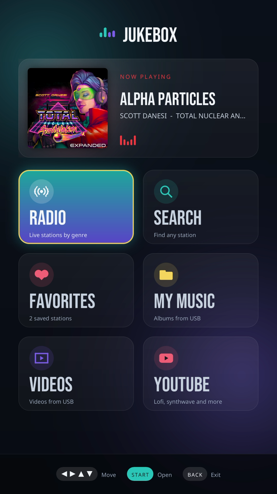
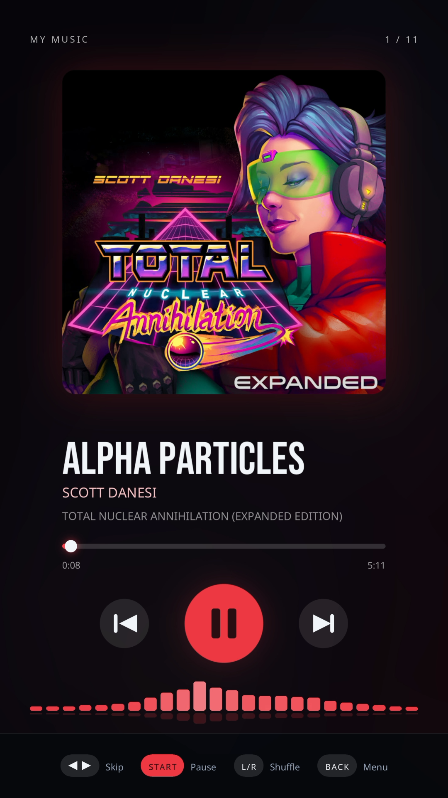
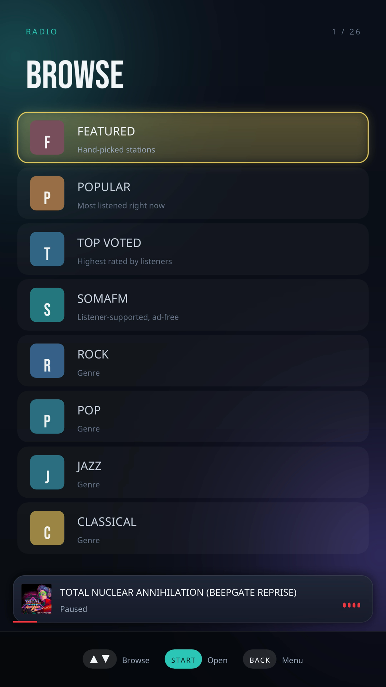

# 🎛️ Jukebox

**Website: [bla1ze.github.io/atgames-juke-box](https://bla1ze.github.io/atgames-juke-box/)**

<p align="center">
  
  
  
</p>


A music and internet-radio player for AtGames devices. Browse thousands of online
radio stations, search by name, save your favorites, play audio files from a
USB drive, or play videos and YouTube on the backglass — with an album-tinted
**Now Playing** screen, a spinning record for radio, and a live spectrum
analyzer that dances to the music.

Plays MP3, AAC, FLAC, OGG, Opus, WAV, and WMA, plus MP4, M4V, MKV, MOV, WebM
and AVI videos.

---

## ✨ New in 2.4

- **YouTube.** A new **YouTube** tile plays YouTube on the backglass: **Search
  YouTube**, or pick a music channel — **Lofi Girl** (its 24/7 live radios),
  **NewRetroWave**, **NoCopyrightSounds** and **NPR Music** (Tiny Desk). The
  video's thumbnail becomes the cover on Now Playing, and the rest of the list
  plays after it. See **Watching YouTube** below.
- **Six tiles.** The main menu is now three even rows: Radio, Search /
  Favorites, My Music / Videos, YouTube.
- The radio **LIVE** badge is centered properly.

## New in 2.3

- **Videos on the backglass.** A new **Videos** strip on the main menu plays
  video files from a `videos` folder on the USB drive. The picture fills the
  backglass while the playfield shows Now Playing with a progress bar, and the
  rest of the folder plays after it, like an album. Works on the 4KP and HDP.
- **Videos over Wi-Fi.** The transfer page, now **Add music and videos over
  Wi-Fi**, takes video files too and puts them in the `videos` folder.
- Counts read "1 album" and "1 track" instead of "1 albums".

## New in 2.2

- **Add music over Wi-Fi.** In **My Music**, choose **Add music over Wi-Fi**.
  The cabinet shows an address and a PIN: open the address in a browser on any
  computer or phone on the same network and drop in songs, or whole artist and
  album folders. They go into the drive's `music` folder with their folders
  kept, and the library updates when you press `Back`.
- **Updates from inside the app.** When a new version is out, a banner appears
  under the main menu tiles. Select it to download, install and restart. Your
  favorites, music, and the app's picture and description are untouched. (2.2
  is the first version with this, so install 2.2 itself by hand.)

## New in 2.1

- **The right thing on every screen.** On the HDP, the menu used to appear on
  the backglass with the backglass artwork on the playfield. Which physical
  screen is which varies by cabinet, and Jukebox now reads the model and places
  all three correctly on both the 4KP and the HDP.
- **Favorites without the arcade control panel.** Saving a station needed `Y`,
  which plain cabinets don't have. **A flipper** now saves (or removes) the
  highlighted station, and favorites the station on Now Playing. `Y` still works
  if you have the panel.

Full history in [CHANGELOG.md](CHANGELOG.md).

## New in 2.0

- **A redesigned look.** Smooth rounded shapes, soft glows, one consistent type
  scale, and a button legend along the bottom of every screen showing exactly
  which buttons do what.
- **Now Playing takes on the album's colors** — the cover fills the background
  as a soft blur, the art sits large in front, and a **progress bar** shows elapsed
  and total time.
- **Radio gets a spinning record** with the spectrum radiating around it and a
  pulsing **LIVE** badge.
- **A new main menu** — a Now Playing card with the current artwork, and big
  tiles for Radio, Search, Favorites, and My Music.
- **A mini player** on every list, so you can see what's playing while you browse.
- **FLAC album art now shows**, even for large embedded covers.
- **Every artist is listed** — artists on compilations and soundtracks used to
  go missing — and picking an artist now opens **that artist's songs**.
- **Lists wrap around** — go past the bottom and you're back at the top.
- **Long titles scroll on the backglass** instead of shrinking.

---

## How it works

Open Jukebox and you land on the main menu:

| | |
| --- | --- |
| **🎵 Now Playing** (top card) | What's playing, with its album art. Open it for the full Now Playing screen. |
| **📻 Radio** | Browse curated categories — a **Featured** shortlist (WMMR 93.3 Philadelphia, Q104.3 Halifax), Popular, Top Voted, SomaFM, and genres like Rock, Jazz, Lo-fi, Ambient — streamed live from the online directory. |
| **🔎 Search** | Type a station name on the on-screen keyboard to find it. |
| **❤️ Favorites** | Your saved stations, kept between sessions. |
| **📁 My Music** | Your own music from a USB drive, browsable by album and artist. |
| **🎬 Videos** | Video files from a USB drive, played on the backglass. |
| **▶️ YouTube** | Search YouTube or pick a music channel; plays on the backglass. Needs yt-dlp (asked for the first time). |

Pick a station or track and it starts playing. Playback keeps going in the
background while you browse other screens — the **mini player** at the bottom of
each list shows what's on — so hunting for the next song never cuts the music.
In any list, a name too long to fit **scrolls** while it's highlighted, and lists
**wrap** from the last row back to the first (and the other way).

On **Now Playing**, a local track shows its **album cover** over a blurred wash of
itself, with the title, artist, album, and a **progress bar**. The play button and
highlights take on the album's colors. No art? A record spins in its place. For
radio, the record spins with the spectrum radiating around it, and the station's
codec, bitrate, and favorite status sit beneath its name. `←/→` skip to the
previous or next track (or station) from wherever you started listening. When a
local track finishes, the **next one plays automatically** — and with **shuffle**
on, the queue plays in a random order.

---

## 🎵 Playing your own music

Jukebox looks for a folder named **`music`** at the **root of a USB drive**, then
scans it (and every sub-folder) and builds a browsable library — grouped by
**Album** and **Artist**, like iTunes.

1. On a computer, open your USB drive.
2. Create a folder named `music` (all lowercase) in the drive's root.
3. Copy your music into it. Sub-folders **are** scanned, so an
   `Artist/Album/track` layout works great.
4. Eject the drive, plug it into the device, and open **My Music**.

```
USB DRIVE (root)
└── music/
    ├── Daft Punk/
    │   └── Discovery/
    │       ├── cover.jpg
    │       ├── 01 One More Time.mp3
    │       └── 02 Aerodynamic.mp3
    └── Bonobo/
        └── Migration/
            └── 01 Migration.flac
```

**Browsing:** My Music opens to **Albums**, **Artists**, **All Tracks**, a
**Shuffle** toggle, and **Add music and videos over Wi-Fi**.

- **Albums** lists every album with its artist and track count. Open one and play
  a track — `←/→` on Now Playing then steps through that album, and when it ends
  the next track starts on its own.
- **Artists** lists everyone in your library, including artists who only appear on
  a compilation or soundtrack. Pick one to see **all of their songs** across every
  album (each shown with the album it's from), and play straight from there.

Albums are grouped by name *and* folder, so two different albums that share a
name (say, two *Greatest Hits*) stay separate. An album split into `CD1` / `CD2`
(or `Disc 1` / `Disc 2`) sub-folders stays one album, and an album with several
artists shows as **Various Artists**.

**Album art** comes from either:

- an image in the album's folder — `cover`, `folder`, or `front` (`.jpg`, `.jpeg`,
  or `.png`, any capitalization), Windows Media Player's `AlbumArt…Large.jpg`, or
  failing those, any other image in the folder; or
- a picture embedded in the file — MP3 (`APIC`) or FLAC (`PICTURE`), at any size.
  When a file has several pictures, the front cover wins.

No art? A spinning record shows instead. Pictures embedded in M4A/AAC files
aren't read yet — put a `cover.jpg` in the folder for those.

**Shuffle:** turn it on from the **Shuffle** row (it shows ON/OFF) or with a
**flipper** on Now Playing while local music is playing. It's a mode — once on, whatever you play
(an album, an artist, or All Tracks) runs in random order until you turn it off,
and Now Playing shows a **SHUFFLE** tag.

**Where the album/artist names come from:** Jukebox reads the embedded tags —
**ID3v2** in MP3s and **Vorbis comments** in FLAC (title, artist, album, track
number). For other files, or files without tags, it falls back to the folder
layout: the file's parent folder becomes the album and the one above it the
artist. Anything it can't place lands under **Unknown Album / Unknown Artist**.

**Supported formats:** `mp3` · `m4a` · `aac` · `flac` · `ogg` · `opus` · `wav` · `wma`
(tags are read from MP3 and FLAC; the rest still play and group by folder.)

**Over Wi-Fi:** no need to take the drive out. In **My Music**, choose **Add
music and videos over Wi-Fi** (or press `Start` on the *"No music found"*
screen). Jukebox shows an address like `http://192.168.1.20:8080` and a 4-digit
PIN. Open the address in a browser on a computer or phone on the same network,
enter the PIN, and drop in songs, videos or folders. Folders are kept (up to
three levels, like `Artist/Album/Disc 1`), cover images come along, and files
already there are skipped. Videos go to the `videos` folder, everything else to
`music`. Press `Back` on the cabinet when you're done and the library rescans.

Seeing *"No music found"*? Make sure the folder is named exactly `music`, sits at
the drive's root, and holds files of the types above. A large library shows
**"Scanning library…"** briefly on first open while tags are read.

---

## 🎬 Playing your own videos

Jukebox plays video files from a folder named **`videos`** at the **root of the
USB drive**, on the backglass.

1. Create a folder named `videos` (all lowercase) in the drive's root.
2. Copy your videos into it. Sub-folders work, and show as folders in the list.
3. Plug the drive in and choose **Videos** on the main menu.

```
USB DRIVE (root)
├── music/
└── videos/
    ├── Live at Wembley.mp4
    └── Music Videos/
        ├── 01 First Video.mp4
        └── 02 Second Video.mkv
```

Pick a video and it plays on the **backglass**, with its sound through the
cabinet. The **playfield** shows Now Playing with the title and a progress bar,
and the **DMD** shows the title. Like an album, the rest of the folder plays
after it; `←/→` skip, `Start` pauses, and shuffle works here too. When the
video ends, the backglass goes back to the Jukebox artwork.

You can also send videos over Wi-Fi: **My Music › Add music and videos over
Wi-Fi** puts them in the `videos` folder.

**Supported formats:** `mp4` · `m4v` · `mkv` · `mov` · `webm` · `avi`. **H.264
video up to 1080p at 30 fps plays best.** 4K, 60 fps or HEVC (H.265) files may
stutter, since the cabinet decodes video in software. There's no seeking within
a video yet.

---

## ▶️ Watching YouTube

Choose **YouTube** on the main menu. The list starts with **Search YouTube**,
then four music channels:

| Channel | Opens |
| --- | --- |
| **Lofi Girl** | Its 24/7 live radios (lofi hip hop, sleep, lofi house and more) |
| **NewRetroWave** | The latest synthwave and outrun videos |
| **NoCopyrightSounds** | The latest EDM releases |
| **NPR Music** | The latest videos, mostly Tiny Desk concerts |

Pick a video and it plays on the **backglass** like Videos, with Now Playing on
the playfield: the video's **thumbnail as the cover**, its channel, and a
progress bar (live streams have no length). The rest of the list plays after it;
`←/→` skip and shuffle works too. It takes a few seconds to start ("Finding the
stream"), and if YouTube sends it slower than it plays, Now Playing says
**"Buffering: the stream is slow right now"** for a moment.

**One-time setup:** YouTube plays through
[yt-dlp](https://github.com/yt-dlp/yt-dlp), a free, public-domain tool that
isn't part of Jukebox. The first time you open YouTube, Jukebox asks, then
downloads it from yt-dlp's GitHub releases (about 3 MB) into its `data` folder,
and keeps it up to date weekly in the background. YouTube needs the internet.

Thumbnails are kept as a small cache (the 50 most recently played, a few MB);
older ones are removed automatically.

---

## On the backglass and DMD

Jukebox lights them up too:

- The **backglass** shows the current album cover big — the crisp cover over a
  soft, blurred wash of itself, with the track title and artist beneath. A title
  or artist too long to fit **scrolls** across instead of shrinking. On radio it
  shows the station name.
- While a **video** plays, it fills the backglass instead.
- The **DMD** strip becomes a lit **Jukebox marquee** — the logo on a neon
  gradient, with the track title (or station name) captioned below it.

Which physical screen is which differs between cabinet models, so Jukebox reads
the model to place the playfield, backglass and DMD correctly. The panels redraw
only when the track changes (plus the scrolling line, when there is one), so
they never affect playback or the spectrum analyzer. Cabinets without extra
panels simply ignore them.

**If a screen still shows the wrong thing**, send a log (see *Sending a log*
below): it shows what your cabinet is doing. The same `jukebox.cfg` file can
force the assignment: `playfield`, `backglass` and `dmd` each take a connector
number from the log.

---

## Controls

The bottom of every screen shows the buttons that work there. **Flipper** means
either shoulder button, so nothing needs the arcade control panel — `Y` and `X`
still work for anyone who has one.

| Screen | Buttons |
| --- | --- |
| **Menu** | `Arrows` move between the Now Playing card and the tiles · `Start` open · `Back` exit |
| **Radio** | `Arrows` select · `Start` open / play · `Flipper` favorite · `Back` up a level |
| **Search** | `Arrows` move · `Start` press key · `Back` to menu — then `Start` play, `Flipper` favorite on results |
| **Favorites** | `Arrows` select · `Start` play · `Flipper` remove · `Back` to menu |
| **My Music** | `Arrows` select · `Start` open a list / play a track / toggle Shuffle · `Back` up a level (or to menu at the top) |
| **Videos** | `Arrows` select · `Start` open a folder / play a video · `Back` up a folder (or to menu at the top) |
| **YouTube** | `Arrows` select · `Start` open a channel / play a video (on the keyboard, press a key) · `Back` up a level (or to menu at the top) |
| **Now Playing** | `←/→` previous / next · `Start` pause · `Flipper` shuffle (local) or favorite (radio) · `Back` to My Music's view list (if you started there) or the menu |

---

## Good to know

- **Radio, Search and YouTube need an internet connection.** My Music and Videos
  work offline.
- **Updates:** Jukebox checks GitHub for a new version when it starts (quietly;
  offline is fine). A banner under the main menu tiles offers it; the update
  replaces only `jukebox-app.elf` and then restarts Jukebox.
- Favorites are saved on the device and survive restarts — and carry over from
  1.x, so your saved stations are still there after upgrading.
- Radio stations come and go — if one won't play, it may simply be offline; try
  another.
- Auto-advance, shuffle, and the progress bar apply to **local files and
  YouTube** (music, videos, YouTube lists) —
  radio streams are continuous, so there's no length to show or next track to
  advance to.

## Sending a log

Something not working (a screen showing the wrong thing, a YouTube video or
cover that won't load, the backglass not changing)? A log usually shows why:

1. On a computer, create a plain text file named `jukebox.cfg` at the **root of
   the USB stick**, next to the `external` folder.
2. Put this one line in it: `diag = 1`
3. Plug the stick back in, open Jukebox and do whatever goes wrong.
4. Close Jukebox and copy `jukebox-panels.log` from the root of the stick.

Then [open an issue](https://github.com/Bla1ze/atgames-juke-box/issues): say
what you did and what you saw, and attach the log. While `diag` is on, Jukebox
also labels each screen with which panel it is; delete `jukebox.cfg` (or set
`diag = 0`) when you're done.

---

## 🙏 Credits

- Fonts: **Noto Sans** & **Bebas Neue** (SIL Open Font License; the full texts are in the
  release zip's `licenses` folder, with `CREDITS.txt`).
- Images: **stb_image** by Sean Barrett (public domain).
- YouTube: **[yt-dlp](https://github.com/yt-dlp/yt-dlp)** (public domain, Unlicense). It isn't
  shipped with Jukebox: the app downloads it from yt-dlp's GitHub releases the first time you open
  YouTube, after asking, and keeps it up to date weekly. Jukebox isn't affiliated with YouTube,
  Google, or the channels it lists; videos belong to their creators.
- Display info: @n-i-x
